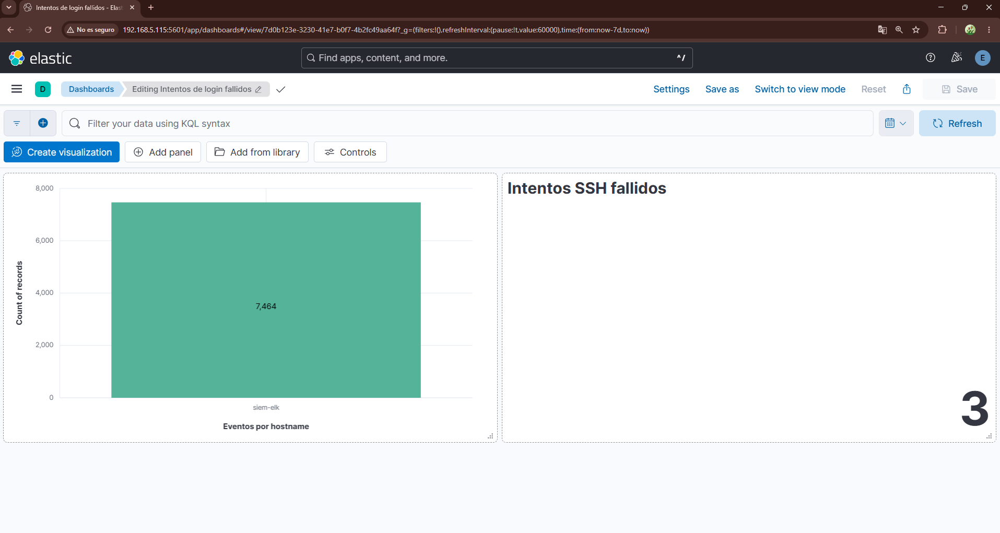

# SIEM Lab con ELK Stack 🛡️

Entorno SIEM funcional montado desde cero con Elastic Stack 8.x 
sobre Ubuntu Server en VirtualBox.

## Stack tecnológico
- Elasticsearch 8.x — motor de búsqueda e indexación
- Kibana 8.x — visualización y dashboards
- Logstash 8.x — procesamiento de logs
- Filebeat 8.x — agente de recolección de logs

## Capacidades implementadas
- ✅ Ingesta de logs del sistema Linux en tiempo real
- ✅ Detección de intentos de login fallidos (SSH brute force)
- ✅ Dashboard de monitorización de eventos de autenticación

## Hallazgo de ejemplo
Detección en tiempo real de intentos de acceso SSH 
con usuario inexistente `usuariofake` desde 192.168.5.45

## Hallazgo detectado
- 3 intentos de acceso SSH con usuario inexistente detectados en tiempo real
- Ubuntu 26.04 registra estos eventos como `Invalid user` en lugar de 
  `Failed password` — diferencia identificada durante el análisis

